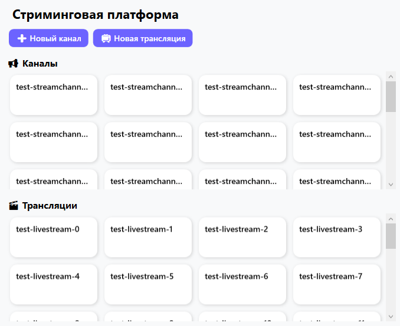
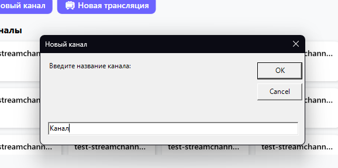
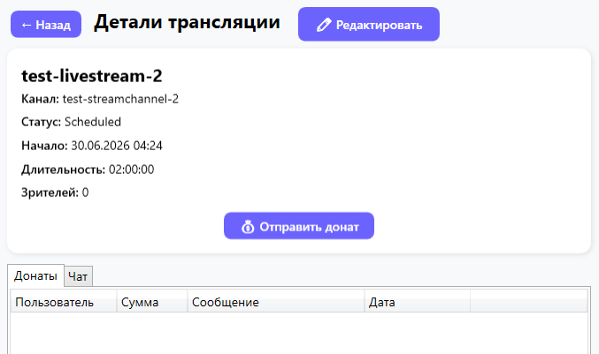
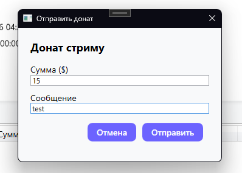
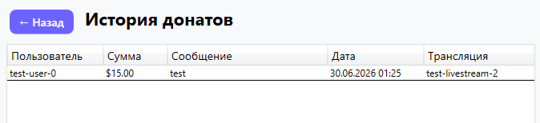
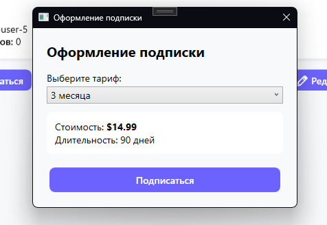

 Дипломный проект: Стриминговая платформа (WPF)

## 1. Описание проекта
Приложение предназначено для управления трансляциями, каналами и подписками пользователей в рамках учебной практики. Реализован полный цикл: создание и редактирование каналов/трансляций, оформление подписок, отправка донатов, просмотр чата и истории донатов, формирование аналитических отчётов по каналам.

Тип работы: Выпускная квалификационная работа (дипломный проект)  
Вариант: 8

---

## 2. Цель и задачи проекта
**Цель:** разработка WPF-приложения для управления стриминговыми каналами и их контентом.

**Задачи:**
- анализ предметной области (стриминговые платформы);
- проектирование базы данных из семи таблиц;
- разработка отдельного модуля бизнес‑логики (`StreamingPlatformCore`);
- создание WPF-интерфейса с навигацией и карточками;
- покрытие ключевой бизнес‑логики модульными тестами;
- документирование публичного API с помощью XML‑комментариев.

**Область применения:** учебная практика / демонстрация навыков работы с C#, WPF, Entity Framework Core.

---

## 3. Функциональность
- Просмотр списка каналов и трансляций (MasterPage);
- Детальная карточка канала с возможностью подписки, генерации отчёта и просмотра истории донатов;
- Детальная страница трансляции с таблицей донатов и чат‑сообщениями;
- Окно подписки с выбором тарифа;
- Окно отправки доната;
- Редактирование названия/описания канала и параметров трансляции;
- Формирование отчёта по каналу (общий доход, средняя длительность, количество подписчиков и др.);
- Валидация активности подписки и расчёт дохода от подписок и донатов;
- История донатов с фильтрацией по каналу.

**Ограничения:**
- Аутентификация не реализована – используется первый пользователь в базе;
- Чат‑сообщения отображаются в read‑only режиме;
- Приложение функционирует в тестовом режиме с возможностью сброса базы.

---

## 4. Архитектура проекта
Тип архитектуры: клиентское приложение с прямым подключением к базе данных.

**Технологии:**
- Язык: C#
- UI: WPF (MVVM)
- ORM: Entity Framework Core
- База данных: SQLite (файловая) / Microsoft SQL Server (конфигурируется)
- Тестирование: NUnit
- Документирование: XML‑комментарии

---

**Структура проекта:**
- `docs/` — документация
- `StreamingPlatform/` — WPF приложение
- `StreamingPlatformCore/` — ядро для приложения, бизнес логика
- `StreamingPlatformTests/` — модульные тесты

---

## 5. Установка и запуск

**Требования:**
- .NET 8+
- Visual Studio 2022 (рекомендуется) либо любой редактор с поддержкой C#
- Для SQL Server – доступ к экземпляру (строка подключения в `ApplicationContext.cs`)

**Установка:**
```bash
git clone https://github.com/u-Kotovsky/c-streaming-platform.git
cd c-streaming-platform
dotnet restore
```

**Запуск:**
```bash
dotnet build
dotnet run --project StreamingPlatform
```

---

## 6. Использование
После запуска системы пользователь может:
- добавление канала
- добавление трансляции
- посмотреть список каналов
- посмотреть список трансляций
- выбрать канал
- выбрать трансляцию
- подписаться на канал
- посмотреть историю донатов
- редактировать канал
- отправить донат
- добавить фильм в понравившиеся
- управлять подпиской

---

## 7. Демонстрация
- Скриншоты интерфейса представлены в папке `docs/`

<figure>
    
    <figcaption>Рисунок 1 - Главное меню, список трансляций и каналов</figcaption>
</figure>
<br>
<figure>
    
    <figcaption>Рисунок 2 - Создание нового канала</figcaption>
</figure>
<br>
<figure>
    
    <figcaption>Рисунок 3 - Детали трансляции</figcaption>
</figure>
<br>
<figure>
    
    <figcaption>Рисунок 4 - Донат стриму</figcaption>
</figure>
<br>
<figure>
    
    <figcaption>Рисунок 5 - История донатов</figcaption>
</figure>
<br>
<figure>
    
    <figcaption>Рисунок 6 - Оформление подписки</figcaption>
</figure>

---

## 8. Тестирование
Для запуска тестов:
```bash
dotnet test
```

Типы тестов:
- модульные

---

## 9. Результаты и выводы
В ходе выполнения дипломного проекта было разработано клиентское WPF-приложение для стриминговой платформы. Решение включает:

- **Полноценную базу данных** из семи взаимосвязанных таблиц (пользователи, каналы, трансляции, подписки, донаты, чат-сообщения, категории).
- **Библиотеку бизнес‑логики** (`StreamingPlatformCore`) с сервисами расчёта доходов, проверки активности подписки, формирования аналитических отчётов.
- **Интуитивно понятный пользовательский интерфейс** с современным дизайном, карточками каналов и трансляций, навигацией с историей переходов и формами для оформления подписок и отправки донатов.
- **Набор модульных тестов**, подтверждающих корректность ключевых алгоритмов.

Практическая значимость работы заключается в демонстрации навыков проектирования многослойной архитектуры на C#, разработки графического интерфейса с использованием паттерна MVVM, работы с ORM Entity Framework Core и написания тестируемого кода. Полученное приложение может служить основой для построения реального сервиса потокового вещания или использоваться в качестве учебного примера.

---

## 10. Связь с дипломной работой
Данный репозиторий содержит практическую часть выпускной квалификационной работы на тему «Разработка программного модуля для управления трансляциями, каналами и подписками пользователей». В рамках практической реализации выполнены:

- Анализ предметной области и проектирование структуры базы данных.
- Реализация программной логики (расчёт доходов, проверка подписки, статистика по каналам).
- Создание WPF-интерфейса с элементами управления и навигацией.
- Обработка данных (CRUD-операции, формирование отчётов, история донатов).
- Модульное тестирование.

Описание приведено в пояснительной записке.

---

## 11. Автор
Студент: Левченко Дмитрий Александрович
Группа: ИСП-9  
Специальность: 09.02.07 Информационные системы и программирование  

Руководитель: Дмитриев А.А.

Контакты:
- email: id.u.kotovsky@gmail.com
- GitHub: https://github.com/u-Kotovsky


# LICENSE
Проект разработан в учебных целях.
